<div align="center">

# GoCognigo

**High-Performance Document Intelligence Engine**

*Ingest hundreds of documents. Ask complex questions. Get cited answers in seconds.*

[](https://go.dev)
[](LICENSE)

[Features](#-features) · [Screenshots](#-screenshots) · [Quick Start](#-quick-start) · [Architecture](#-architecture) · [API Reference](#-api-reference)

</div>

---

## Overview

GoCognigo is a document intelligence engine built in Go that combines **hybrid retrieval** (BM25 + vector search) with **multi-provider LLM reasoning** to answer complex questions across large document corpora. It handles PDFs (including scanned), DOCX files, and supports OCR — all through a modern dark-themed web interface.


---

## ✨ Features

### Hybrid RAG Pipeline

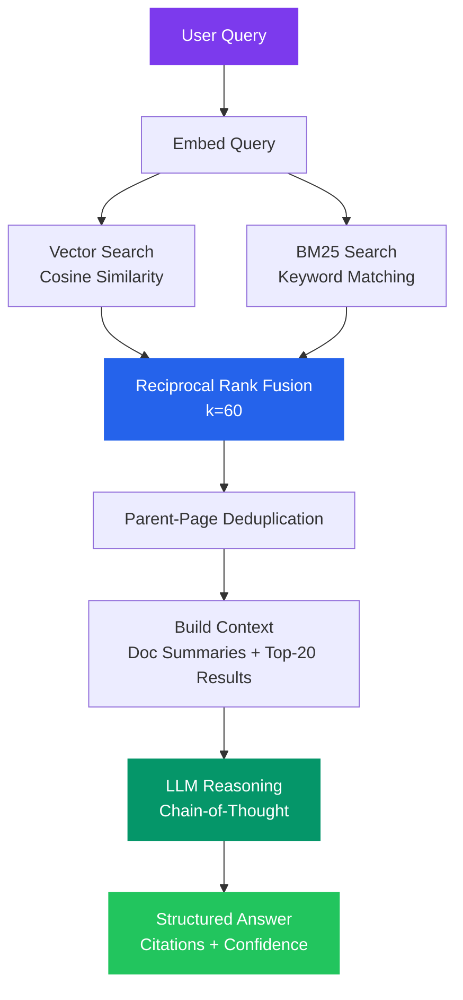

- **Dual-index retrieval** — BM25 keyword search (Bleve) + vector cosine similarity working together
- **Reciprocal Rank Fusion** — Merges ranked results without needing score calibration
- **Parent-page context** — Small chunks (~150 words) for precise retrieval; full parent pages sent to LLM for rich reasoning

### Multi-Provider LLM

| Provider | Models | Use Case |
|----------|--------|----------|
| **Anthropic** | Claude Opus 4.6, Sonnet, Haiku | Best structured output compliance |
| **OpenAI** | GPT-4o, o-series reasoning | Fastest, reasoning model support |
| **HuggingFace** | Qwen 2.5 72B, Llama, Phi-4 | Open-source, free tier |

Switch providers and models at runtime from the UI — no restart required.

### Chain-of-Thought Reasoning

Every answer includes a collapsible reasoning trace showing the LLM's step-by-step analysis, inline `[N]` footnote citations linking to specific documents and pages, and a confidence score (0.0–1.0) with explanation.

### Document Processing

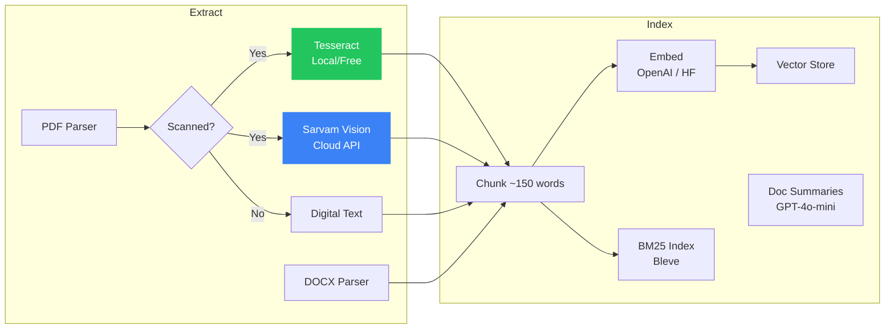

- **PDF & DOCX** extraction with page-level chunking
- **Smart OCR fallback** — Auto-detects scanned pages, tries Tesseract first, falls back to Sarvam Vision
- **LLM-generated summaries** — Structured metadata (title, type, sections, key entities) for each document
- **Concurrent pipeline** — 4 extractors, 6 embedding workers, all stages overlap in time

### Project Management

- **Isolated projects** — Each project has its own files, indexes, and conversations
- **LRU cache** — Up to 5 project indexes held in memory for instant switching
- **Per-file management** — Add or remove individual files, even after processing
- **Persistent conversations** — Auto-named, with full message metadata (thinking, sources, model, timing)

### Batch Evaluation

Run multiple questions in parallel — total time equals the slowest single query, not the sum. Built for benchmarking throughput against time budgets.

### Security

- **AES-256-GCM** encryption for API keys at rest (machine-derived key)
- **Path traversal protection** on all file operations
- **Graceful shutdown** with context cancellation propagation

---

## 📸 Screenshots

### Upload Phase
Drag-and-drop interface for PDF and DOCX files with project sidebar navigation.

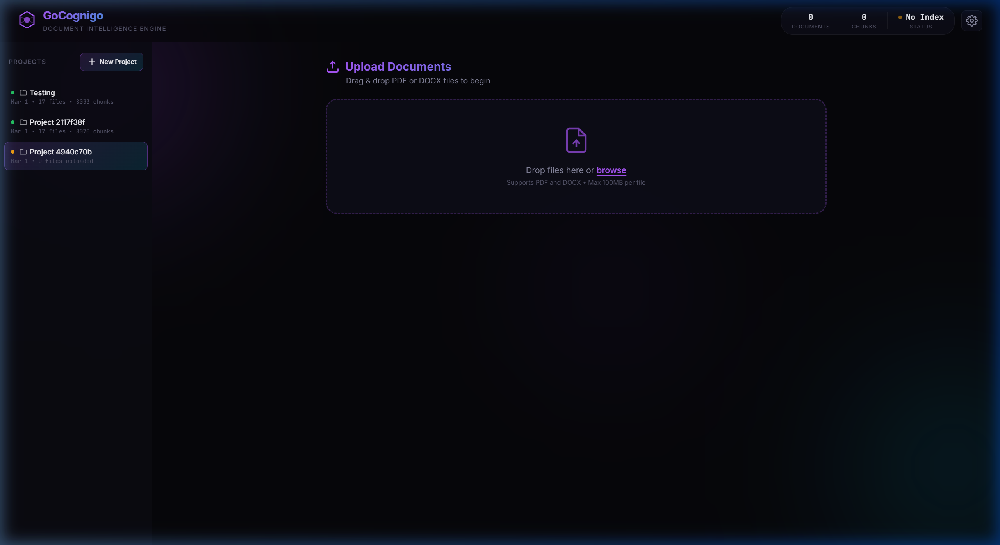

### Chat Interface
Answers with inline footnote citations, source document links with page numbers, confidence scoring, and response timing.

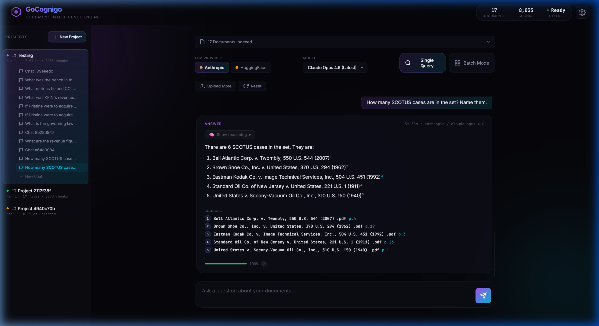

### Chain-of-Thought Reasoning
Expandable reasoning trace showing the LLM's step-by-step analysis before arriving at the answer.

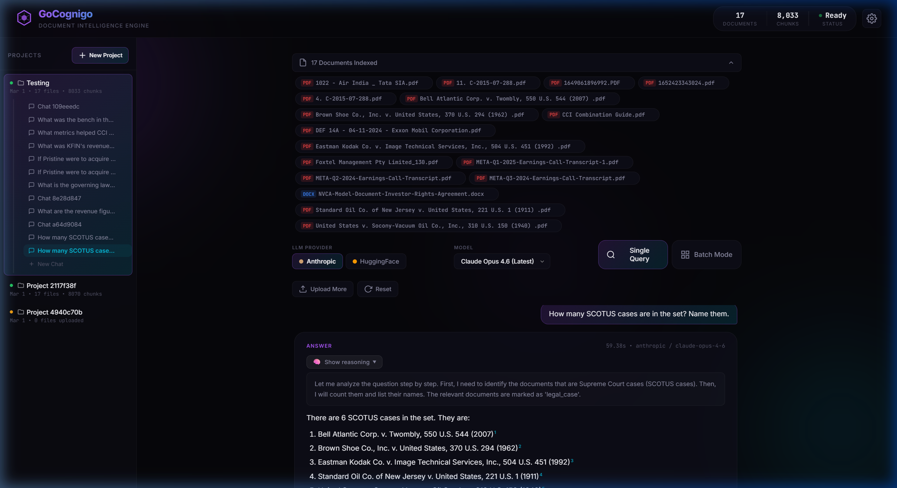

### Indexed Documents
Expandable panel showing all ingested documents with type badges (PDF/DOCX).

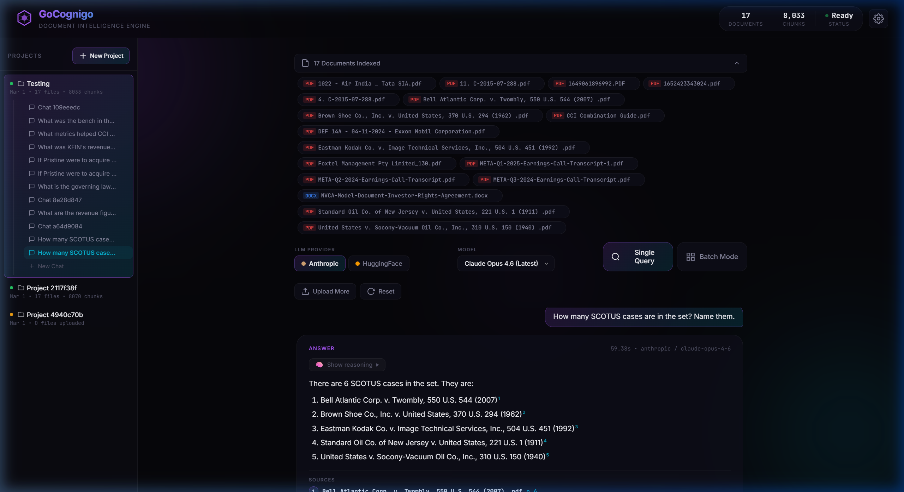

### Batch Mode
Load multiple questions and run them simultaneously against the corpus with a time budget indicator.

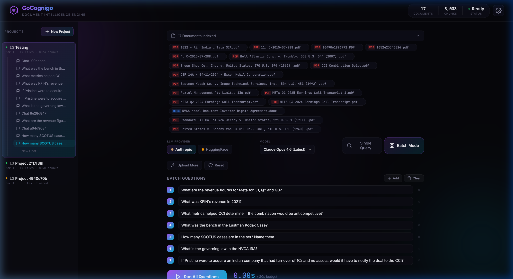

### Settings
Runtime configuration for LLM providers, embedding providers, API keys, and OCR with status indicators.

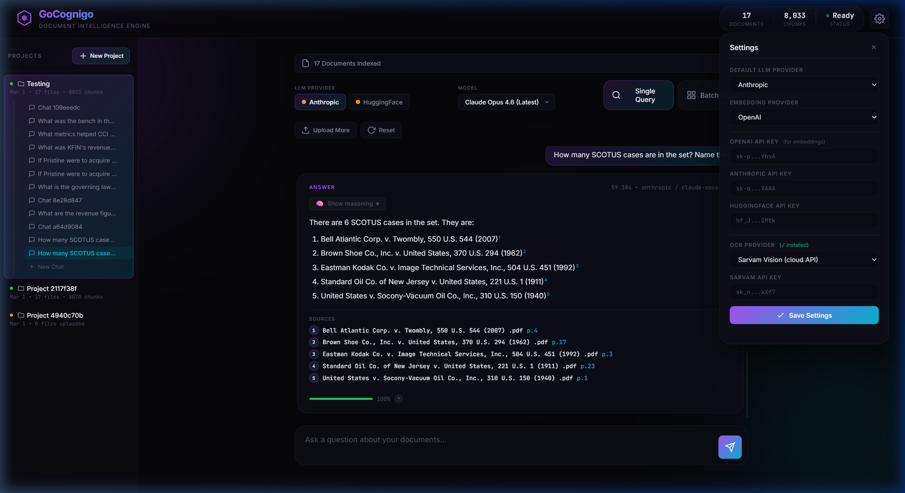

---

## 🚀 Quick Start

### Prerequisites

- **Go 1.21+** — Auto-installed by `start.ps1` if missing
- **API Keys** — At least one of: OpenAI, Anthropic, or HuggingFace

### Setup

```bash
# Clone
git clone https://github.com/nss-ark/gocognigo.git
cd gocognigo

# Configure
cp .env.example .env
# Edit .env with your API keys

# Run (auto-installs Go, Tesseract, Poppler if missing)
# On Windows:
.\start.ps1
# On Linux/macOS:
chmod +x start.sh && ./start.sh
```

Or manually:
```bash
go mod tidy
go build -o gocognigo.exe ./cmd/server/
./gocognigo.exe
```

Open [http://localhost:8080](http://localhost:8080)

### Environment Variables

| Variable | Default | Description |
|----------|---------|-------------|
| `LLM_PROVIDER` | `anthropic` | Default LLM: `openai`, `anthropic`, `huggingface` |
| `OPENAI_API_KEY` | — | Required for embeddings and document summaries |
| `ANTHROPIC_API_KEY` | — | Anthropic Claude access |
| `HUGGINGFACE_API_KEY` | — | HuggingFace Inference API |
| `EMBEDDING_PROVIDER` | `openai` | `openai` or `huggingface` |
| `OCR_PROVIDER` | auto-detect | `tesseract`, `sarvam`, or empty |
| `SARVAM_API_KEY` | — | Sarvam Vision cloud OCR |
| `PORT` | `8080` | HTTP server port |

> **Note:** Settings can also be changed at runtime from the UI settings panel, persisted to `data/settings.json`.

---

## 🏗 Architecture

### Project Structure

```
GoCognigo/
├── cmd/server/                    # HTTP server & API layer
│   ├── main.go                    # Entry point, env loading, route setup
│   ├── server.go                  # Server struct, LRU cache, settings
│   ├── handlers_ingest.go         # Upload, ingestion pipeline
│   ├── handlers_query.go          # Query, batch, stats, providers
│   ├── handlers_project.go        # Project CRUD
│   ├── handlers_conv.go           # Conversation CRUD
│   └── handlers_settings.go       # Settings with encrypted persistence
│
├── internal/
│   ├── extractor/                 # PDF, DOCX, OCR extraction
│   ├── indexer/                   # Chunking, embedding, BM25+vector indexing
│   ├── retriever/                 # Hybrid search with RRF
│   ├── llm/                       # Multi-provider LLM integration
│   ├── chat/                      # Project & conversation persistence
│   └── crypto/                    # AES-256-GCM encryption
│
├── web/                           # Vanilla JS SPA (ES Modules)
├── docs/screenshots/              # UI screenshots
├── start.ps1                      # One-click startup script
└── data/                          # Runtime data (gitignored)
```

### Ingestion Pipeline

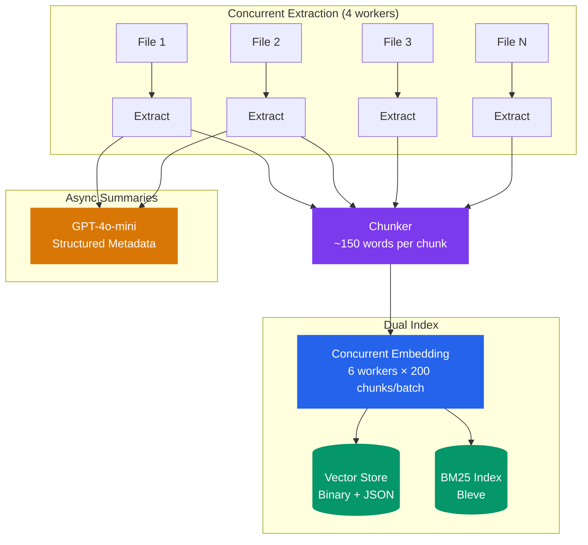

All stages run concurrently — embedding starts before extraction finishes through a streamed pipeline architecture.

### Query Flow

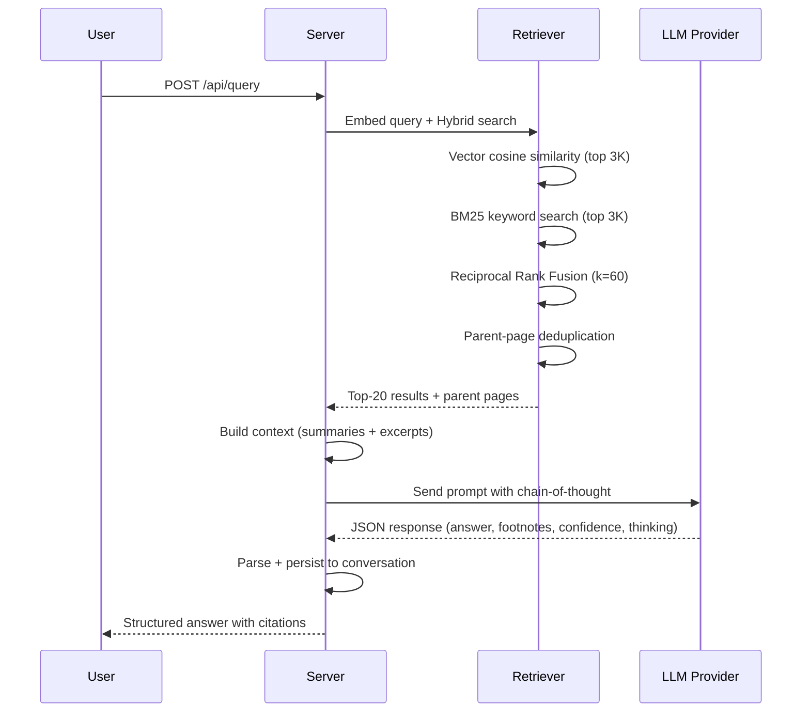

### Data Storage

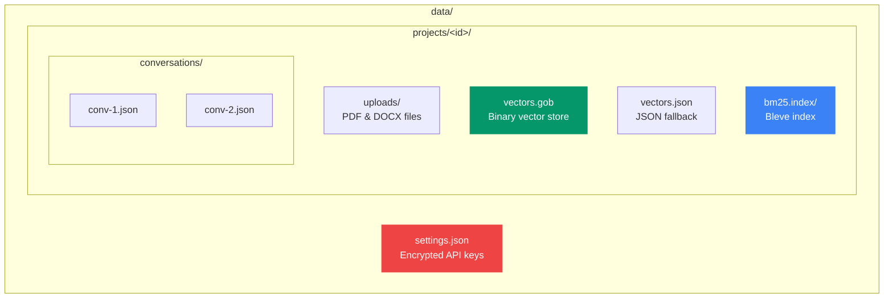

---

## 📡 API Reference

### Documents & Ingestion

| Method | Endpoint | Description |
|--------|----------|-------------|
| `POST` | `/api/upload` | Upload PDF/DOCX files (multipart, max 100MB) |
| `GET` | `/api/files?project_id=X` | List uploaded files |
| `DELETE` | `/api/files` | Clear all files and indexes |
| `POST` | `/api/files/delete` | Remove a single file + its index entries |
| `POST` | `/api/ingest` | Start ingestion pipeline |
| `GET` | `/api/ingest/status` | Poll ingestion progress |
| `POST` | `/api/ingest/cancel` | Cancel in-progress ingestion |
| `GET` | `/api/index-status` | Check index readiness |

### Querying

| Method | Endpoint | Description |
|--------|----------|-------------|
| `POST` | `/api/query` | Single question → cited answer |
| `POST` | `/api/batch` | Parallel questions → all answers + total time |
| `GET` | `/api/stats?project_id=X` | Index stats (docs, chunks, providers) |
| `GET` | `/api/providers` | Available LLM models per provider |

### Projects & Conversations

| Method | Endpoint | Description |
|--------|----------|-------------|
| `GET` | `/api/chats` | List projects |
| `POST` | `/api/chats` | Create project |
| `POST` | `/api/chats/activate` | Switch active project |
| `POST` | `/api/chats/rename` | Rename project |
| `DELETE` | `/api/chats/delete` | Delete project + all data |
| `GET` | `/api/conversations?project_id=X` | List conversations |
| `POST` | `/api/conversations` | Create conversation |
| `POST` | `/api/conversations/messages` | Get messages |
| `POST` | `/api/conversations/rename` | Rename conversation |
| `POST` | `/api/conversations/delete` | Delete conversation |

### Settings

| Method | Endpoint | Description |
|--------|----------|-------------|
| `GET` | `/api/settings` | Get current settings |
| `POST` | `/api/settings` | Update settings (keys encrypted on save) |

---

## 🛠 Tech Stack

| Layer | Technology | Purpose |
|-------|-----------|---------|
| Language | **Go 1.21+** | Native concurrency, single-binary deploy |
| BM25 | **Bleve** | Pure Go full-text search |
| Embeddings | **OpenAI / HuggingFace** | 1536-dim vector embeddings |
| LLM | **Anthropic / OpenAI / HuggingFace** | Multi-provider structured QA |
| PDF | **ledongthuc/pdf** | Pure Go PDF parsing |
| DOCX | **nguyenthenguyen/docx** | Word document extraction |
| OCR | **Tesseract + Sarvam Vision** | Scanned PDF processing |
| Encryption | **AES-256-GCM** | API key protection at rest |
| Frontend | **Vanilla JS (ES Modules)** | Zero-framework SPA |
| Persistence | **Filesystem (Gob + JSON + Bleve)** | No database required |

---

## 📊 Performance

| Metric | Value |
|--------|-------|
| Concurrent extraction workers | 4 goroutines |
| Embedding batch size | 200 chunks/call |
| Concurrent embedding workers | 6 goroutines |
| Index cache | 5 projects (LRU) |
| Batch query parallelism | All questions concurrent |
| Typical query time (single) | 3–8s |
| Typical batch (15 questions) | 5–12s total |

---

<div align="center">

**Comply Ark (NSS-ARK)**

</div>
